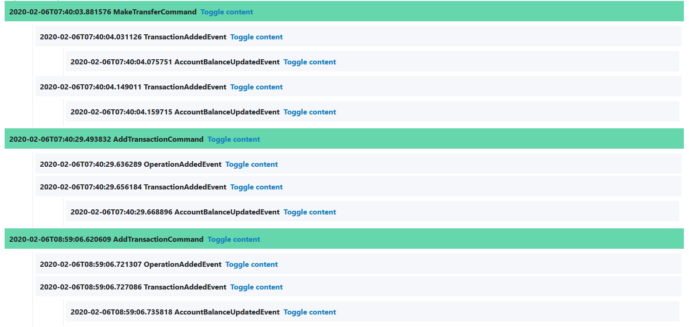

### Disclimer
*If you need in-memory bus for asp.net core please consider [MediatR](https://github.com/jbogard/MediatR). They have different nomenclature (Request\Response instead of Queries and Notification instead of Commands\Events) but they additionally support synchronous flows and async flows with cancellation tokens. Many more project use MediatR and they have an 'existing' community support.*

# Marcus.Bus

**Highly opinionated**, asynchronous, in-memory, event bus for aps.net core with support for CQRS and EventSourcing (or rather Command sourcing).

Extracted from code base of a production system which runs on it since 2016.

## Design principles

Marcus.Bus has been designed to be light-weight and concise. The goal was to introduce CQRS and EventSourcing in ASP.net projects without relying on external messaging system.

Some of the invariants:
* each command has exactly one handler
* each event can have zero, one or more handlers 
* each query has exactly one handler
* each execution path/request can only start with command or query (you can't simply publish event)
* each published event has either source command or source event (each execution path can be traced from command/event store)
* bus uses .net async/await functionality to increase throughput

When in-memory bus is not-enough?

`If you just ordered dual AMD Epyc 64 Cores/128 Threads (128C/256T in total) server (which at the time of writing is most performant single node server you can buy) then it's time to think about distributed systems. Otherwise you brake first three rules of deciding if you need distributed system (which are: 1. don't. 2. don't 3. don't).`


Marcus.Bus is split into two assemblies. Marcus.Bus.Abstractions which contains all base interfaces and base classes and Marcus.Bus which contains implementation and all required infrastructure code. Web project (ASP.net core) will reference Marcus.Bus and assemblies containing commands, events and handlers will reference Marcus.Bus.Abstractions.

Below is main bus interface. It provides means to dispatch commands, publish events and execute queries. This is the interface used in actions/endpoints.

```csharp
public interface IBus
{
    Task Handle<T>(T command) where T : Command;

    Task Publish<T>(T @event, Command sourceCommand) where T : Event;
    Task Publish<T>(T @event, Event sourceEvent) where T : Event;

    Task<T> Execute<T>(Query<T> query);
}
```
Each action in the system starts with a `Command`. Command handler can publish any number of events and each event can have zero, one or many handlers. Event handlers can also publish events.

Whenever developer publishes an event he has to provide the bus reference to source ``Command`` or source ``Event``. This way based on stored commands and events we can track what happened in the system (we can visualize each command execution as a tree which has a command at the root and events as children).

Dispatching command or publishing an event doesn't return any values. 

The only way to obtain values is to use queries. More about queries below. 

## Commands and Command Handlers 

Commands must inherit from the base ``Command`` type. See below list of properties from the base type. 
|Property                            |Description                         |
|------------------------------------|------------------------------------|
|`Guid CommandId`|Unique command id.|
|`string RequestId`|String identifier of the request in which command has been dispatched.|
|`string SessionId`|String identifier of the session. We generate unique session id every time user logs into the system.|
|`Guid TenantId`|Tenant identifier. Useful when command replay logic should work on tenant level.|
|`Guid PublishedBy`|User identifier (user which initiated command).|
|`DateTime PublishedUTC`|UTC date and time.|

### Commands validation

Bus will validate commands before executing command handlers. I found it significantly reduces chance for bugs (usually commands get corrupted by invalid data coming from the ui).

``Command`` base type does some basic validations but you can add additional validation by overriding ``void ValidateCommand()``.

Marcus.Bus is using [Marcus.Validation](https://github.com/belczyk/Marcus.Validation) library. ``Command`` is inheriting from ``ObjectWithValidation`` so developer has access to all Marcus.Validation methods inside ``ValidateCommand`` method.

See example below:
```csharp 
protected override void ValidateCommand()
{
    NotDefault(Id,nameof(Id));
    NotDefault(AssetId, nameof(AssetId));
    NotNullOrEmpty(DamageDescription, nameof(DamageDescription));
    NotDefault(StatusId, nameof(StatusId));
    AreValid(ExternalRepairs, nameof(ExternalRepairs));
    AreValid(InternalRepairs, nameof(InternalRepairs));
}
```

Also if your validation requires dependencies you can implement external validator for a command. If validator is registered in dependency injection container, the bus will find it and execute validation before handling command. 

Validator must implement ``ICommandValidator<in T> where T : Command`` interface, however it's much more handy to inherit from ``CommandValidator<T> where T : Command``, you'll get access to all Marcus.Validation methods.

### Command handler 
Command handlers must be in a type implementing marker interface ``IHandler``. 
There can be only one handler for a command and Bus will validate configuration and enforce this invariant at startup.

Command handler must be a public method returning ``Task`` and having one argument, a command.
See below example:
```csharp
public class RepairHandler : IHandler
{
    // ...
    public RepairHandler(IBus bus, IRepairRepository repairRepository)
    {
        // ...
    }

    public async Task Handle(CreateRepairFromRequestCommand command)
    {
        // ...
    }

    // ...
}
```

## Events and Event Handlers 
Events must inherit from `Event` base class. 
|Property                            |Description                         |
|------------------------------------|------------------------------------|
|`Guid EventId`|Unique event id.|
|`string RequestId`|String identifier of the request in which command has been dispatched.|
|`string SessionId`|String identifier of the session. We generate unique session id every time user logs into the system.|
|`Guid TenantId`|Tenant identifier. |
|`Guid PublishedBy`|User identifier (user which initiated event).|
|`DateTime PublishedUTC`|UTC date and time.|
|`DateTime SourceCommandId`| If event has been published by command handler this property must be set to command id of handled command. |
|`DateTime SourceEventId`| If event has been published by event handler this property must be set to event id of handled event. |

Event handlers must be in a type implementing marker interface ``IHandler``.

Event handler method must be public, return `Task` and have one argument, handled event.

An example of event handler: 
```csharp
public class TransactionHandler : IHandler
{
// ...
    public async Task Handle(AccountUpdatedEvent @event)
    {
        // ...
    }

// ...
}
```

Examples of publishing events:

```csharp
// publish from command handler
await Bus.Publish(new RepairUpdatedEvent(...), command);
// publish from event handler
await Bus.Publish(new AccountBalanceUpdatedEvent(...), @event);
```
## Queries and Queries Handlers
All queries must inherit from `Query<T>` class where `T` is query return type.


Queries handler class must implement marker interface `IHandler`. 

Query handler method must return   `Task<T>` and take one argument of `Query<T>` type. 

Example queries handler: 
```csharp
public class RepairQueriesHandler : IHandler
{
    // ...

    public async Task<IList<Repair>> Handle(RepairsQuery query)
    {
        // ...
    }
}

```

Example use of queries: 
```csharp
var repairs = await Bus.Execute(new RepairsQuery());
```

## Tracking 
Because each execution flow starts with `Command` and each `Event` *knows* from which command/event handler it has been published we can easily build a tracking tool showing what exactly happens in the system.

In many cases you can find solution for bugs just by looking at Command/Event stream.



## Metrics
Marcus Bus is reporting number of metrics. It helps you to quickly find bottle necks in your system. We save metrics to SQL database and use special query to calculate percentile statistics for different metrics. Based on that we know exactly which queries/commands must be optimized. We decorate all metrics with `TenantId`, `SessionId` and `RequestId` which helps us in debugging and also helps asses how big working data set was for given metric.

Among others: 
* Total time of processing execution flow (starting from command to last event)
* Time of command handling
* Time of event handling 
* Time of query execution
* Time of command/event persisting 

 
